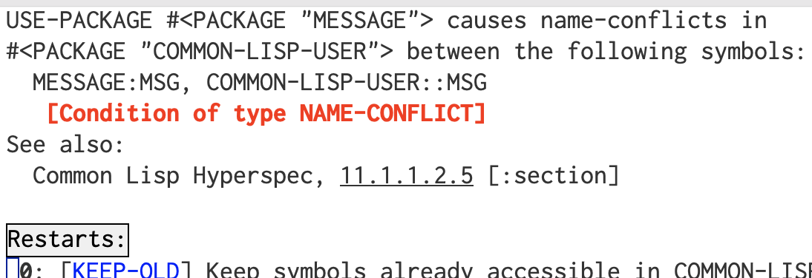

# Description

This file defines macros, a class, and methods for printing at various levels of verbosity.  By using different macros for different verbosity levels, and by setting the global verbosity, you can control what is printed from your code for various purposes.  

For example, though I often disparage the use of &ldquo;debugging by print statement&rdquo; in general (when you have access, like you do in Lisp, to a good debugger), it is often still really good to be able to quickly see what your code is doing when it&rsquo;s misbehaving *without* having set breakpoints to drop into the debugger or to use single-stepping and tracing.  For this reason I often insert debugging statements in my code to let me know what it is doing, the value of important variables, etc.  Rather than commenting these out when they are (perhaps temporarily) not needed, I can just change the verbosity from &ldquo;debugging&rdquo; to &ldquo;normal&rdquo;.

All messages from the statements are ultimately produced by methods of an instance of the class `message-handler`; by default, the instance used is the one created by this file and stored in the global (dynamic) variable `*message-handler*`.  A message handler tracks the current verbosity level, indentation (which you can change as well), and destination for the messages (the stream pointed to by the Lisp-defined `*standard-output*` variable by default).   Macros are provided here to not only make it easy to use message handling, but also to allow there to be no method calls when the verbosity is lower than the message&rsquo;s.

Since `*message-handler*` is a dynamic variable, you are free to rebind it, e.g., using `let,` at any time to a different instance of `message-handler` with (e.g.) a different destination for messages.  So if you have a function such as:

    (defun foo (file)
      (with-open-file (out file :direction :output :if-does-not-exist :create 
    		   :if-exists :supersede)
        (let ((*message-handler* (make-instance 'message-handler
    			       :destination out)))
          (msg out "Hi there!"))))

the string &ldquo;Hi there&rdquo; will be sent to the file when called, and when the function exits, messages will go back to being directed to wherever the default message handler is set to send them.

# Message macros

The message macros are of two kinds: ones that take zero or more arguments and print each one separately (unformatted message macros); and ones (formatted message macros) that take at least one argument, a format string of the type used by the `format` function, with additional arguments used also like `format`, i.e., to provide data to use in the format string.  

The unformatted message macros are:

-   `msg`: prints when verbosity is at least `:normal` (see below for how to set the verbosity)
-   `vmsg`: prints when verbosity is at least `:verbose`
-   `dmsg`: prints when verbosity is at least `:debugging`
-   `vdmsg`: prints when verbosity is `:verbose-debugging`
    
    Any argument to the macro except the symbol `t` prints immediately following any previous arguments.  The symbol `t` is used to specify a new line.  Thus
    
        (msg 'hi 'there 'bob)
    
    would print:
    
        HITHEREBOB
    
    whereas
    
        (msg 'hi " " 'there t 'bob)
    
    would print
    
        HI THERE
        BOB
    
    The formatted message macros are `fmsg`, `vfmsg`, `dfmsg`, and `vdfmsg`, with behavior corresponding to their unformatted counterparts with respect to verbosity.  As an example,
    
        (vfmsg "Hi there, ~a!" 'bob)
    
    would print
    
        Hi there, BOB!
    
    By default, the formatted messages print on separate lines, with a line break, if needed, before printing and one afterward.  If you prefer to control where all line breaks happen, you can change this behavior by using the `fmsg-inserts-line-breaks` macro with the argument `t`.

# Creating message handlers

A message handler instance is created when you load this file and stored in the `*message-handler*` variable.  To create a new message handler, instantiate `message-handler` with the parameters you want; you can let everything default by simply doing:

    (setq *message-handler* (make-instance 'message-handler))

There are several keyword parameters that can be set when instantiating the message handler:

-   `:destination` &#x2013; Set this to a stream where you want messages to go.  It defaults to `*standard-output*`.
-   `:verbosity` &#x2013; Set this to the verbosity you want, one of `:silent` `:normal` `:verbose` `:debugging`, or `:verbose-debugging`.  By default, verbosity is `:normal`.  If you set it to `:silent`, none of the message macros will print anything.
-   `:fmsg-inserts-line-breaks` &#x2013; Set this to `t` if you want a line break to be output after every formatted message macro, to `nil` if you do not.  The default is `t`
-   `:indentation` &#x2013; How far messages should be indented from the left margin; controls how many spaces are output prior to messages. The default is 0.
-   `:indentation-delta` &#x2013; Set this to how many spaces you want each call to `with-indent` or `indent-messages` to increase indentation; default is 2.

# Changing message handling behavior

This file provides some macros to change aspects of how messages are handled as well as to access some settings of the message handler instance.  These are:

-   `(set-destination` *stream* `)` &#x2013; Set the output destination to *stream*.
-   `(destination)` &#x2013; Returns the current destination.
-   `(silence-messages)`, `(silent-messages)`, and `(no-messages)` &#x2013; These all do the same thing: turn off all messages.
-   `(normal-messages)`, `(verbose-messages)`, `(debugging-messages)` &#x2013; These set the verbosity correspondingly
-   `(verbose-debugging-messages)` and `(all-messages)` &#x2013; These both set the verbosity to print all kinds of messages.
-   `(verbosity)` &#x2013; Returns the current verbosity level.
-   `(fmsg-inserts-line-breaks` *t/nil* `)` &#x2013;
-   `(set-indentation` *num* `)` &#x2013; Sets the number of spaces to precede messages.
-   `(set-indentation-delta` *num* ) &#x2013; Sets the number of spaces `indent` and `with-indentation` adds to the current indentation (and that `deindent` subtracts).
-   `(with-indentation` *form\(^*\)* `)` &#x2013; This is used to &ldquo;wrap&rdquo; the forms (i.e., Lisp &ldquo;statements&rdquo;) in an indentation level.  For example:
    
        (fmsg "hi")
        (with-indentation
            (fmsg "there")
            (with-indentation
                (fmsg "Bob")))
         (fmsg "how's it going?")
    
    would print:
    
        hi
          there
            Bob
        how's it going?
-   `(indent)` &#x2013; Indent future output by the current indentation + the indentation-delta spaces.
-   `(deindent)` &#x2013; Indent future output by the current indentation \(-\) the indentation-delta spaces.
-   `(with-destination` *form\(^*\)* `)` &#x2013; Change the output destination for any message macro called in the forms (or anything they call); see example above.

# Loading and using the macros

As with the `new-symbol.lisp` file, this file defines a new package, `message`, in which all macros, the message handler class, and methods are defined.  To load the file:

    (load "message")

Unless you import the macros, etc., you want from the message package, you will need to prefix them with the package name or nickname (`msg`), e.g.:

    (msg:msg 'hi)
    (message:fmsg "there")

You can import the symbols you want to use with the `import` function, e.g., 

    (import '(msg:msg msg:fmsg))

or you can import all exported symbols (i.e., the ones you want) with:

    (use-package 'message)

**Note:** Depending on your Lisp, you may already have a symbol in the current package you&rsquo;re using that has the same name as one of the exported (external) symbols in the `message` package.  If so, you will encounter an error, either when using `import` for that symbol, `use-package`, or accessing the symbol.  For example, on my setup (macOS, SBCL), if I load this file and then try to `use-package`, I get this error:

If this happens, after you load the file you can use `shadowing-import` to get around this problem.  Suppose that you get an error, as I did, with the `msg` symbol from the `message` package: 

    (shadowing-import 'msg:msg)
    (use-package 'message)

# Code

Set up the package for the messages:

    1  (unless (find-package "MSG")
    2    (defpackage "MESSAGE"
    3      (:use "COMMON-LISP")
    4      (:nicknames "MSG"))
    5      )
    6  
    7  (in-package msg)

Here are all the macro definitions.  Since they are used in the file, they need to come before their use (unlike functions, which can appear after their use in the code).<a id="fnr.1" class="footref" href="#fn.1">1</a>  By the way, if you ever want to see what a macro call turns into, you can do:

    (macroexpand '(msg:msg t 'hi))

or similar.

     8  (defmacro string-append (&rest l)
     9      `(concatenate 'string ,@l))
    10  
    11  (defmacro no-messages? ()
    12    `(eql :silent (slot-value *message-handler* 'verbosity)))
    13  
    14  (defmacro verbose? ()
    15    `(not (member (slot-value *message-handler* 'verbosity) '(:silent :normal))))
    16  
    17  (defmacro silent? ()
    18    `(eq (slot-value *message-handler* 'verbosity) :silent))
    19  
    20  
    21  (defmacro debugging? ()
    22    `(not (member (slot-value *message-handler* 'verbosity) '(:silent :normal :verbose))))
    23  
    24  (defmacro verbose-debugging? ()
    25    `(eql (slot-value *message-handler* 'verbosity) :verbose-debugging))
    26  
    27  (defmacro normal-messages ()
    28    `(setf (slot-value *message-handler* 'verbosity) :normal))
    29  
    30  (defmacro silence-messages ()
    31    `(setf (slot-value *message-handler* 'verbosity) :silent))
    32  
    33  (defmacro silent-messages ()
    34    `(setf (slot-value *message-handler* 'verbosity) :silent))
    35  
    36  (defmacro no-messages ()
    37    `(setf (slot-value *message-handler* 'verbosity) :silent))
    38  
    39  (defmacro verbose-messages ()
    40    `(setf (slot-value *message-handler* 'verbosity) :verbose))
    41  
    42  (defmacro debugging-messages ()
    43    `(setf (slot-value *message-handler* 'verbosity) :debugging))
    44  
    45  (defmacro all-messages ()
    46    `(setf (slot-value *message-handler* 'verbosity) :verbose-debugging))
    47  
    48  (defmacro verbose-debugging-messages ()
    49    `(setf (slot-value *message-handler* 'verbosity) :verbose-debugging))
    50  
    51  (defmacro msg (&rest l)
    52    `(unless (no-messages?)
    53       (unformatted-message *message-handler* ,@l)))
    54  
    55  (defmacro vmsg (&rest l)
    56    `(when (verbose?)
    57       (unformatted-message *message-handler* ,@l)))
    58  
    59  (defmacro dmsg (&rest l)
    60    `(when (debugging?)
    61       (unformatted-message *message-handler* ,@l)))
    62  
    63  (defmacro vdmsg (&rest l)
    64    `(when (verbose-debugging?)
    65       (unformatted-message *message-handler* ,@l)))
    66  
    67  (defmacro fmsg (string &rest l)
    68    `(unless (silent?)
    69       (formatted-message *message-handler* ,string ,@l)))
    70  
    71  (defmacro vfmsg (string &rest l)
    72    `(when (verbose?)
    73       (formatted-message *message-handler* ,string ,@l)))
    74  
    75  (defmacro dfmsg (string &rest l)
    76    `(when (debugging?)
    77       (formatted-message *message-handler* ,string ,@l)))
    78  
    79  (defmacro vdfmsg (string &rest l)
    80    `(when (verbose-debugging?)
    81       (formatted-message *message-handler* ,string ,@l)))
    82  
    83  (defmacro set-destination (stream)
    84    `(setf (slot-value *message-handler* 'destination) ,stream))
    85  
    86  (defmacro destination ()
    87    `(slot-value *message-handler 'destination))
    88  
    89  (defmacro verbosity ()
    90    `(slot-value *message-handler* 'verbosity))
    91  
    92  (defmacro fmsg-inserts-line-breaks (&optional (value t))
    93    `(setf (slot-value *message-handler*) ,value))
    94  
    95  (defmacro set-indentation (num)
    96    `(setf (slot-value *message-handler* 'indentation) ,num))
    97  
    98  (defmacro set-indentation-delta (num)
    99    `(setf (slot-value *message-handler* 'indentation-delta) ,num))

The following is an example of how to &ldquo;wrap&rdquo; some code in some other code, like you see with `with-slots` and `with-open-file`.  The trick is to put the code itself, prior to execution, inside an `unwind-protect` form.  What that does is *always* execute its second argument no matter what&#x2014;even if there are errors.  To do that, you have to group the code you want to protect (thus the `progn`), *and* you don&rsquo;t want the code evaluated until after the `unwind-protect` has been started (thus it needing to be done in a macro).

    100  (defmacro with-indentation (&rest l)
    101    `(progn 
    102       (indent) 
    103       (unwind-protect 
    104         (progn ,@l)
    105       (deindent))))
    106  
    107  (defmacro with-indent (&rest l)
    108    `(with-indentation ,@l))
    109  
    110  (defmacro indent ()
    111    `(push-indentation *message-handler*))
    112  
    113  (defmacro deindent ()
    114    `(pop-indentation *message-handler*))
    115  
    116  (defmacro with-destination (dest &rest l)
    117    `(progn 
    118       (push-destination *message-handler* ,dest)
    119       (unwind-protect 
    120         (progn ,@l)
    121       (pop-destination *message-handler*))))

The message handler class.  The two variables `indentation-stack` and `destination-stack` hold past indentations and destinations so they can be restored.  These are used by the `with-xxx` macros above.

    122  (defclass message-handler ()
    123    (
    124     (destination :initform *standard-output* :initarg :destination)
    125     (verbosity :initform :normal :initarg :verbosity)
    126     (fmsg-inserts-line-breaks :initform t :initarg :fmsg-inserts-line-breaks)
    127     (indentation :initform 0 :initarg :indentation)
    128     (indentation-delta :initform 2 :initarg :indentation-delta)
    129     (indentation-stack :initform nil)
    130     (destination-stack :initform nil)
    131     )
    132    )

These forms are used by the `with-xxx` macros to push and pop indentations and destinations.

    133  (defmethod push-indentation ((self message-handler))
    134    (with-slots (indentation indentation-stack indentation-delta) self
    135      (push indentation indentation-stack)
    136      (setq indentation (+ indentation indentation-delta))))
    137  
    138  (defmethod pop-indentation ((self message-handler)) 
    139    (with-slots (indentation indentation-stack) self
    140      (setq indentation (or (pop indentation-stack) 0))))
    141  
    142  (defmethod push-destination ((self message-handler) dest)
    143    (with-slots (destination destination-stack) self
    144      (push destination destination-stack)
    145      (setq destination dest)))
    146  
    147  (defmethod pop-destination ((self message-handler))
    148    (with-slots (destination destination-stack) self
    149      (setq destination (or (pop destination-stack) *standard-output*))))

This method uses `format` to send formatted messages to the message handler&rsquo;s destination.  

    150  (defmethod formatted-message ((self message-handler) format-string &rest args)
    151    (with-slots (destination) self
    152        (apply #'format
    153  	     (cons destination 
    154  		   (cons (prepare-string self format-string) args)))))

This method prepares a string to be printed by inserting the correct number of spaces for the current indentation and by adding a newline at the beginning and end, if necessary.  Note that I also have used the `~T` format and `~%` directives to do this; I chose spaces for simplicity and `~&` to cut down on unneeded newlines, since if a newline has *just* been issued, that directive does nothing.

    155  (defmethod prepare-string ((self message-handler) string) 
    156    (indent-string self (add-line-break-or-not self string)))
    157  
    158  (defmethod indent-string ((self message-handler) string)
    159    (string-append (indentation-string self) string))
    160  
    161  (defmethod indentation-string ((self message-handler))
    162    (with-slots (indentation) self
    163      (if (zerop indentation)
    164        ""
    165        (make-string indentation :initial-element #\Space))))
    166  
    167  (defmethod add-line-break-or-not ((self message-handler) string)
    168    (with-slots (fmsg-inserts-line-breaks) self
    169      (if (not fmsg-inserts-line-breaks)
    170        string
    171        (string-append "~&" string "~&"))))

This method handles unformatted messages.

    172  (defmethod unformatted-message ((self message-handler) &rest args)
    173    (with-slots (destination) self
    174      (dolist (arg (cons (indentation-string self) args))
    175        (if (eql 't arg)
    176  	(fresh-line destination)
    177  	(write arg :stream destination :escape nil)))))

These are the symbols that are exported, that is, that are external to this package and that thus can be imported (using `import`, e.g.) into your package:

    178  (export '(msg
    179  	  dmsg
    180  	  vmsg
    181  	  vdmsg
    182  	  fmsg
    183  	  vfmsg
    184  	  dfmsg
    185  	  vdfmsg
    186  	  *message-handler*
    187  	  message-handler
    188  	  set-destination
    189  	  destination
    190  	  verbosity
    191  	  fmsg-inserts-line-breaks
    192  	  set-indentation
    193  	  set-indentation-delta
    194  	  with-indentation
    195  	  indent
    196  	  deindent
    197  	  with-destination
    198  	  normal-messages
    199  	  silence-messages
    200  	  silent-messages
    201  	  no-messages
    202  	  verbose-messages
    203  	  debugging-messages
    204  	  verbose-debugging-messages
    205  	  all-messages
    206  	  ))

Now, set up a message handler.  Note that every time you reload this file, a new instance is created.  

    207  (defparameter *message-handler* (make-instance 'message-handler))

# Footnotes

<a id="fn.1" href="#fnr.1">1</a> But not, of course, after they are actually *called*!
