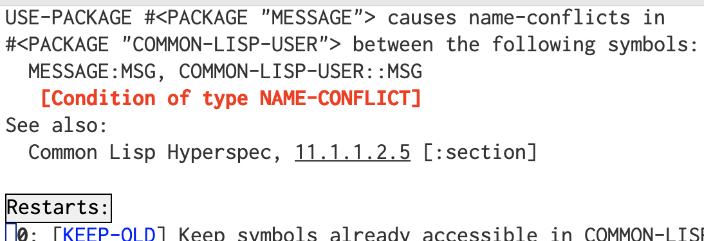

# Table of Contents

1.  [Description](#org3ef8997)
2.  [Loading the simulator](#orgf5a8241)
    1.  [If you get an error about package/symbol problems](#orgcd66641)
3.  [Creating a simulator](#org68c446e)
4.  [Creating a new robot type](#org5f5ae25)
    1.  [Percept format](#orgd778055)
    2.  [Adding new percept components](#org2a19005)
    3.  [Adding new actions](#org418d40f)
5.  [Adding your robot to the simulator](#orgd64cbaa)
6.  [Changing the world](#org28fe8e3)
7.  [Simulating your work](#org2371f16)
8.  [Miscellaneous methods](#org0d8d37c)
9.  [Code](#org06502ab)
    1.  [Package setup](#org08b8308)
    2.  [Global variables](#org4246425)
    3.  [Classes](#orga5c22ce)
    4.  [Simulator methods](#org8fde021)
        1.  [Sensor methods](#org0f70a00)
        2.  [Effector (actuator) methods](#org9631940)
    5.  [World methods](#orgb856046)
    6.  [Object methods](#org0e3be09)
    7.  [Robot methods](#org0961528)
    8.  [Example: `random-robot`](#orgb52df53)

# Description

This is a very simple &ldquo;robot world&rdquo;  simulator for use by COS 470/570  students for the search assignment. It allows you to define a rectangular world and add some obstacles and one or more robots.  It provides a base class for robots you will define: basically all you have to do is to define a robot class based on `robot` that has at least the method `agent-program` that you define to carry out the search program you&rsquo;re interested in; this method will accept a percept in the form described below and provide an action from among the ones defined in `*commands*`.  You can then use the `run` function of the simulator to test your agent.  

There are also functions available give you all of the obstacle locations for when you implement your A\* search, as well as a very simple function (`world-sketch`) to show you an overview of the current world.

# Loading the simulator

To load the simulator, make sure that the files `message.lisp`, `new-symbol.lisp`, and `simulator.lisp` are in Lisp&rsquo;s current directory (usually the one you start Lisp in, and the one where your code lives).  Then just do:

    (load "simulator")

The simulator is in its own package, `simulator`, which has the nickname `sim`.  Thus you either need to preface all of the simulator-related functions (below) with the package name or nickname, like:

    (sim:create-simulator)

 or import the symbols you are interested in using, e.g.:

    (import '(sim:create-simulator sim:run))

 or import *all* exported symbols from the package:<a id="fnr.1" class="footref" href="#fn.1">1</a>

    (use-package 'sim)

## If you get an error about package/symbol problems

Depending on your Lisp, you may already have a symbol in the current package you&rsquo;re using that has the same name as one of the exported (external) symbols in one or more of the other packages you&rsquo;re
importing symbols from, which will result in an error.  For example, with my setup (macOS, SBCL), if I load the &ldquo;messages.lisp&rdquo; file, then try to `use-package`, I get this error:

If this happens, after you load the file you can use `shadowing-import` to get around this problem.  Suppose that you get an error when calling `use-package` for the simulator package that tells you the symbol `name` is in conflict with an existing one in your current package (usually `cl-user`).  You can fix this by doing the following:

    (shadowing-import 'sim:name)
    (use-package sim)

You&rsquo;ll want to make sure that whatever the symbol `name` had been used for in your current package is not important, though, since you&rsquo;ll no longer be able to access it (except, perhaps, as `cl-user::name`).  If it was important, you probably want to change to a different name for it.

# Creating a simulator

In order to create a new simulator, you use the `create-simulator` function, which has the following format:

    create-simulator &key (size '(10 10)) (num-obstacles 0) 
                                        (obstacle-locations nil)

 That is, the default size is 10&times;10, and no obstacles are added by default when you do:

    (create-simulator)

 You can override these defaults, of course.  To make a different-sized world, e.g.:

    (create-simulator :size '(50 50))

 or to add 10 obstacles:

    (create-simulator :size '(50 50) :num-obstacles 10)

Obstacles created this way will be put in random locations.  If you want to put obstacles in particular places, you can do something like:

    (create-simulator :size '(50 50) 
                                :obstacle-locations '((1 1) (3 4) (10 10)))

 **Note:** The \((x,y)\) coordinates for the world are 1-based, not 0-based.

You can combine these as well:

    (create-simulator :size '(50 50) :num-obstacles 10 
                                :obstacle-locations '((1 1) (3 4) (10 10)))

 will add 10 random obstacles as well as at the three specified locations.

You will want to put the simulator instance returned by this into a variable, since you&rsquo;ll need it later to do anything:

    (setq sim (create-simulator))

# Creating a new robot type

To run your agent code, you&rsquo;ll need to create a new kind of robot and add it to the simulator.  I have provided a base class for you to use, `robot`.  The base class has instance variables for the robot&rsquo;s name (`name`), current location (`location`), current orientation (`orientation`, one of `:north`, `:south`, `:east`, or `:west`), the last percept seen (`percept`), the next action the agent program has selected (`next-action`), the previous action (`prev-action`), and the success status of the previous action (`prev-action-success`, one of `t` or `nil`).

You should not in general, however, access these yourself from your agent program, since these are *simulation* values, not information the agent program knows.  For example, you may want your agent program, for model-based and goal-based agents,  to have and maintain  its own idea of where it is.  This may differ from the real location due to noise or other problems with sensors.  However, for your goal-based agent assignment, where you will be using A\* and other search techniques, you may want to just assume no noise and use objects&rsquo; and the robot&rsquo;s real positions.

You want your agent program&#x2014;i.e., your AI code&#x2014;to be run automatically by the simulator at each &ldquo;clock tick&rdquo;.  The simulator is designed to call a `clock-tick` method of each object (obstacles, robots) for each of its own clock ticks after figuring out what that object should see of the world (i.e., it&rsquo;s percept).  For objects that are not active or are stationary, this is essentially a dummy method.  For a robot class inheriting from the base `robot` class, the clock tick function calls the class&rsquo; `agent-program` method, giving it the current percept. The `agent-program` method determines what the next action should be and returns it, and the `clock-tick` both sets the robot&rsquo;s `next-action` instance variable and returns the next action to its caller.  The simulator&rsquo;s own `clock-tick` method then continue by calling a method (`take-action`) to simulate the effect of the robot&rsquo;s `next-action`.

To run your code, you will need to create another robot class based on `robot` and define its `agent-program` method to call your code.  (In fact, you will create a different robot class for each of the parts of the assignment, most likely.)  I have provided a sample robot class, `random-robot`, that you can look at (below or in `simulator.lisp`) to see how to do this.

For example, suppose you have written a reflex agent program, named `reflex` that takes a percept and returns an action to take.  Then all you need to do is:

    (defclass reflex-agent (robot) ())
    
    (defmethod agent-program ((self reflex-agent) percept)
      (reflex percept))

Note that for other kinds of agents, you may need to have a bit more code in `agent-program` to give your agent program code additional information about the world (e.g., the location of objects in the world).

## Percept format

For the search assignment, the robots have a very  limited repertoire of sensors: just a forward-looking sonar-type thing that can  sense what is directly in front of the robot and four bump sensors, one on each side and in the front and rear, that can detect whether or not the robot bumped into something due to the *previous* command.  This information is calculated by the simulator&rsquo;s `clock-tick` method and put into the robot&rsquo;s `percept` slot just prior to calling the robot&rsquo;s own `clock-tick` method.

The format of the percept is an *association list*, a list of lists, one for each sensor.  Each list is composed of the sensor name (a symbol) followed by the current value.  The sensors are named `:front-sensor`, `:front-bump`, `:right-bump`, `:left-bump`, and `:rear-bump`, each of which will have a value of  `t` or `nil` in each percept.  

Here&rsquo;s an example percept:

    ((:forward-sensor t)
     (:front-bump nil)
     (:right-bump t)
     (:rear-bump nil)
     (:left-bump nil))

 This would correspond to a situation in which there is something directly in front of the robot, and the last action caused it to bump into something on its right side.<a id="fnr.2" class="footref" href="#fn.2">2</a>

Association lists like this are very common in Lisp, especially when you want to have key/value pairs, but don&rsquo;t want a hash table.  There is a special Lisp function, `assoc`, that is made for interacting with association lists; for example, if `percept` holds the percept above, then this:

    (assoc :forward-sensor percept)

 will return:

    (forward-sensor t)

 A common idiom, since we just want the value, not the key/value pair, is:

    (cadr (assoc :forward-sensor percept))

 or

    (first (assoc :forward-sensor percept))

 You can set a value in an association list using `setf`, e.g.,

    (setf (assoc :forward-sensor percept) nili)

 would result in `percept` having  the value:

    ((:forward-sensor nil)
     (:front-bump nil)
     (:right-bump t)
     (:rear-bump nil)
     (:left-bump nil))

You may be wondering what is going on with those colons, and why something like

    (assoc :forward-sensor percept)

 doesn&rsquo;t give an unbound variable error, since `:forward-sensor` isn&rsquo;t quoted.  Recall that all symbols are contained in *packages*, such as `cl-user`, `sim`, etc.  There is a special package, `keyword`, that has no displayed name, and so if you see a symbol like `:forward-sensor` with a colon but no name before it, it is a keyword.  Symbols in the `keyword` package have the very useful property that they all evaluate to themselves.  So you can get something like this:

    CL-USER> :this-is-a-keyword
    :THIS-IS-A-KEYWORD
    CL-USER>

 whereas if you had done that with a symbol of any other package, you would have gotten an error.

## Adding new percept components

You can add new percept components to robots you define based on `robot`.  The `robot` class has an instance variable, `percept-map`, that contains an association list with elements of the form:

    (sensor-name method)

 where `sensor-name` is a keyword that names the sensor&#x2014;and that will show up in the percept&#x2014;and `method` is the method to use to compute its value.  The method, which is called by `calculate-percept` (see the [code](#org2ae3423) below), must take two arguments, a simulator instance and a robot (or your derived, `robot`-based class), and it needs to return the sensor&rsquo;s value.  You can either specify the sensors you want directly in your robot class&rsquo; `percept-map` variable, or you can just add it to the global variable `*robot-percept-map*`, since `robot` itself sets its `percept-map` to that value.

If you do the latter, though, *don&rsquo;t* list a value for `percept-map` in your class definition!  That will override `robot`&rsquo;s.  You&rsquo;re better off, actually,  not listing `percept-map` among the variables you define for your class unless you *do* want to override the default value.

## Adding new actions

You may also want to add actions for the robot that are not provided by the standard `robot` class.  Actions are carried out according to the `command-map` instance variable of the robot; as you can see from the code, this is set for `robot` to be the value of the global variable `*robot-command-map*`.  A command map should be an association list (see [above](#org0308c34)) whose elements are of the form:

    (cmd method)

 where `cmd` is the name of the action (or command) your agent program specifies when it returns and `method` is  a method to carry out the command.  This method needs to accept two arguments, an instance of `simulator` and an instance of `robot` (including your `robot`-derived class); it should return `t` if it succeeds and `nil` if not.  These methods are called by the `take-action` method (see the code below).

You can add your own action/method pairs to `*robot-command-map*` when you define your robot classes, if you like, since they will inherit from `robot`, which uses the value of the variable when instantiated as its own internal command map.   You can also define your own in your robot class.

# Adding your robot to the simulator

Suppose we have the `reflex-agent` as defined above.  To add an instance of it to the world at a random location, we can just do this (assuming `sim` contains a simulator instance):

    (add-robot sim :type 'reflex-agent)

 This will create a new instance of `reflex-agent` for you.  You can instead specify an existing instance by:

    (add-robot sim :robot my-robot)

The `add-robot` method has additional parameters to allow setting the location (`:location`), orientation (`:orientation`), and name (`:name`, which defaults to a new symbol based on `robot`).

# Changing the world

There are various methods that you can use to change the world.  For example, you can add an object (`add-object`), find an object (`find-object`), delete an object (`remove-object`), clear the entire world while leaving the simulator state alone (`clear`), and reset the simulator completely (`reset-simulator`, although why not just create a new instance?).  See the definitions below.

# Simulating your work

The major function to use to run your simulation is just `run`.  Original, no?  This has two parameters, both keyword (and thus optional):

-   `:for` &#x2013; how many clock-ticks to run for
-   `:sketch-each` &#x2013; show the state of the world after each clock tick

So if you want to run it for 10 seconds (if that&rsquo;s what you want  clock-ticks to be):

    (run sim :for 10 :sketch-each t)

With my random robot example, doing this will give:

    SIM> (run s :for 10 :sketch-each t)
    ROBOT0: Moving to (8 2).
    ++++++++++++
    +.......@.@+
    +.........@+
    +..........+
    +......@...+
    +@.........+
    +....@.....+
    +..........+
    +@.@.@.....+
    +.......>..+
    +..@.......+
    ++++++++++++
    ROBOT0: Moving to (9 2).
    ++++++++++++
    +.......@.@+
    +.........@+
    +..........+
    +......@...+
    +@.........+
    +....@.....+
    +..........+
    +@.@.@.....+
    +........>.+
    +..@.......+
    ++++++++++++
    ROBOT0: Turning right, new orientation = :NORTH.
    ++++++++++++
    +.......@.@+
    +.........@+
    +..........+
    +......@...+
    +@.........+
    +....@.....+
    +..........+
    +@.@.@.....+
    +........^.+
    +..@.......+
    ++++++++++++
    ++++++++++++
    +.......@.@+
    +.........@+
    +..........+
    +......@...+
    +@.........+
    +....@.....+
    +..........+
    +@.@.@.....+
    +........^.+
    +..@.......+
    ++++++++++++
    ROBOT0: Moving to (9 3).
    ++++++++++++
    +.......@.@+
    +.........@+
    +..........+
    +......@...+
    +@.........+
    +....@.....+
    +..........+
    +@.@.@...^.+
    +..........+
    +..@.......+
    ++++++++++++
    ROBOT0: Moving to (8 3).
    ++++++++++++
    +.......@.@+
    +.........@+
    +..........+
    +......@...+
    +@.........+
    +....@.....+
    +..........+
    +@.@.@..^..+
    +..........+
    +..@.......+
    ++++++++++++
    ROBOT0: Moving to (9 3).
    ++++++++++++
    +.......@.@+
    +.........@+
    +..........+
    +......@...+
    +@.........+
    +....@.....+
    +..........+
    +@.@.@...^.+
    +..........+
    +..@.......+
    ++++++++++++
    ROBOT0: Moving to (9 2).
    ++++++++++++
    +.......@.@+
    +.........@+
    +..........+
    +......@...+
    +@.........+
    +....@.....+
    +..........+
    +@.@.@.....+
    +........^.+
    +..@.......+
    ++++++++++++
    ROBOT0: Moving to (8 2).
    ++++++++++++
    +.......@.@+
    +.........@+
    +..........+
    +......@...+
    +@.........+
    +....@.....+
    +..........+
    +@.@.@.....+
    +.......^..+
    +..@.......+
    ++++++++++++
    ++++++++++++
    +.......@.@+
    +.........@+
    +..........+
    +......@...+
    +@.........+
    +....@.....+
    +..........+
    +@.@.@.....+
    +.......^..+
    +..@.......+
    ++++++++++++
    NIL
    SIM> 

I have provided a (very) simple way to show the world, examples of which were just shown.  This is the `simulator` method `world-sketch`.  It has keyword arguments that allow you to change what empty characters look like (`:empty-char`), what the side walls look like (`:side-wall-char`), and what the top and bottom look like (`:topo-bottom-char`). 

The character output for each object is obtained by this method by calling each object&rsquo;s `icon` method, which should return a single character.  The `robot` version of this outputs a pointer-like symbol to indicate its orientation.

# Miscellaneous methods

Here are some additional `simulator` methods are provided that you may find useful.  I&rsquo;ve listed them like you would call them, assuming `sim` contains a simulator instance.

-   `(random-location sim)` &rarr; a random location `(x y)` in the world
-   `(random-empty-location sim)` &rarr; a random location that happens to be empty
-   `(next-location sim loc dir)` &rarr; the adjacent location to `loc` in the direction `dir`
-   `(opposite-location sim dir)` &rarr;  the opposite direction from `dir`
-   `(clockwise-direction sim dir)` &rarr; the direction clockwise from  direction `dir`
-   `(counterclockwise-direction sim dir)` &rarr; the direction counterclockwise from  direction `dir`

And here are some `world` methods you may find useful; the following assumes `w` contains an instance of `world`:

-   (objects w) &rarr; list of object instances in the world
-   (object-locations w) &rarr; list of all locations occupied by an object
-   (empty? w loc) &rarr; `t` if the location is empty, `nil` otherwise
-   (in-bounds? w loc) &rarr; `t` if location is inside the world, `nil` otherwise
-   (add-object w object) &rarr; adds the object (or robot or &#x2026;) instance to the world
-   (clear w) &rarr; removes all objects from world
-   (size w) &rarr; size of the world (as two-element list)
-   (delete-object w object), (remove-object w object) &rarr; (synonyms) remove the object from the world
-   (find-object w x) &rarr; returns the object if found, `nil` otherwise; `x` can be an object (and so will return non-nil if the object is in the world), a location (returns the object at that location), or the name of an object (a symbol)
-   (world-array w) &rarr; returns an array representing the world, with icons for objects (using the objects&rsquo;  `icon` methods) and `nil` everywhere else; used by `world-sketch`

((export &rsquo;(objects empty? in-bounds? add-object clear object-locations size delete-object find-objectremove-object world-array))

# Code

In the code below, 
I have split up the action of exporting symbols so that you can better see which ones are available to you to import; look for lines that look like:

    (export ...)

## Package setup

Here is the package setup; see above for how to load the package and use it&rsquo;s exported symbols.  As mentioned, this package uses a couple of others, and the `shadowing-import` function&rsquo;s use is also explained above.

     1  (unless (find-package "SIM")
     2    (defpackage "SIMULATOR"
     3      (:use "COMMON-LISP")
     4      (:nicknames "SIM"))
     5      )
     6  
     7  (in-package sim)
     8  
     9  (load "new-symbol")
    10  (use-package 'sym)
    11  (load "messages")
    12  (shadowing-import 'msg:msg)
    13  (use-package 'message)

## Global variables

The first of these just lists the directions the simulator/world deals with.  The second is a map (well, an association list) that maps from robot actions (e.g., `:right`) to methods that carry out those actions (e.g., `do-move-right`).  The third is a similar map for percepts.  See [above](#org1dbc0d6) for more information about both of them.

    14  (defvar *directions* '(:north :south :east :west))
    15  
    16  (defvar *robot-command-map*
    17      '((:nop do-nop)
    18        (:forward do-move-forward)
    19        (:backward do-move-backward)
    20        (:left do-move-left)
    21        (:right do-move-right)
    22        (:turn-right do-turn-clockwise)
    23        (:turn-left do-turn-counterclockwise)))
    24  
    25  (defvar *robot-percept-map*
    26      '((:front-sensor forward-sensor)
    27        (:front-bump front-bump-sensor)
    28        (:rear-bump rear-bump-sensor)
    29        (:right-bump right-bump-sensor)      
    30        (:left-bump left-bump-sensor)))
    31  
    32  (export '(*robot-command-map* *robot-percept-map* *directions*))

## Classes

Since some classes are referenced by methods of other classes, the classes should be created first.

    33  (defclass simulator ()
    34    (
    35     (world :initarg :world :initform nil)
    36     (time :initarg :time :initform 0)
    37     )
    38    )
    39  
    40  (export 'simulator)
    41  
    42  (defclass world ()
    43    (
    44     (size :initarg :size :initform '(10 10))
    45     (objects :initarg :objects :initform nil)
    46     )
    47    )
    48  
    49  (export 'world)
    50  
    51  (defclass object ()
    52    (
    53     (name :initarg :name :initform (new-symbol 'o))
    54     (location :initarg :location :initform '(1 1))
    55     (orientation :initarg :orientation :initform :north)
    56      )
    57    )
    58  
    59  (export 'object)
    60  
    61  (defclass robot (object)
    62    (
    63     (name :initarg :name :initform (new-symbol 'robot))
    64     (percept :initarg :percept :initform nil)
    65     (next-action :initarg :next-action :initform :nop)
    66     (prev-action :initarg :prev-action :initform nil)
    67     (prev-action-success :initarg :prev-action-success :initform nil)
    68     (command-map :initarg :command-map
    69  		:initform *robot-command-map*)
    70     (percept-map :initarg :percept-map
    71  		:initform *robot-percept-map*)
    72     )
    73    )
    74  
    75  (export 'robot)

## Simulator methods

    76  (defmethod clear ((self simulator))
    77    (with-slots (world) self
    78      (clear world)))
    79  
    80  (export 'clear)
    81  
    82  (defmethod reset-simulator ((self simulator) &key clear?)
    83    (with-slots (time world) self
    84      (setq time 0)
    85      (when clear?
    86        (clear world))))
    87  
    88  (export 'reset-simulator)
    89  
    90  (defmethod add-obstacles ((self simulator) locations)
    91    (dolist (loc locations)
    92      (add-obstacle self loc)))
    93  
    94  (export 'add-obstacles)

This next pair of methods demonstrate CLOS&rsquo; function polymorphism.  CLOS is a *generic function*-based object-oriented system, unlike, say, in Python or Java, where methods are tightly associated with the classes themselves as part of their definitions.  In CLOS, all methods are instances of some &ldquo;generic function&rdquo; that when called, checks to see which method is appropriate for its arguments.  The first method below, for example, would be used if:

    (add-obstacle sim foo)

 is called and `sim` is a simulator instance and `foo` is an instance of `object`.  The second would be called otherwise.

These restrictions aren&rsquo;t limited to user-defined objects, either; for example, you can  specify that an argument must be a symbol, number, cons cell, etc.:

    SIM> (defmethod foo ((a number)) nil)
    #<STANDARD-METHOD SIMULATOR::FOO (NUMBER) {10047F9B93}>
    SIM> (defmethod foo ((a number)) nil)
    #<STANDARD-METHOD SIMULATOR::FOO (NUMBER) {10048391F3}>
    SIM> (defmethod foo (a) t)
    #<STANDARD-METHOD SIMULATOR::FOO (T) {100486CC93}>
    SIM> (foo 3)
    NIL
    SIM> (foo 'a)
    T

     95  (defmethod add-obstacle ((self simulator) (object object))
     96    (with-slots (world) self
     97      (add-object world object)))
     98  
     99  (defmethod add-obstacle ((self simulator) location)
    100    (with-slots (world) self
    101      (add-object world (make-instance 'object :name (new-symbol 'obj) :location location))))
    102  
    103  (export 'add-obstacle)
    104  
    105  (defmethod add-object ((self simulator) object)
    106    (add-obstacle self object))
    107  
    108  (export 'add-object)
    109  
    110  (defmethod add-random-obstacles ((self simulator) &key number (max 20) (min 1))
    111    (unless number
    112      (setq number (random (+ (- max min) 1))))
    113    (dotimes (i number)
    114      (add-random-obstacle self)))
    115  
    116  (export 'add-random-obstacles)
    117  
    118  (defmethod add-random-obstacle ((self simulator))
    119    (with-slots (world) self
    120      (add-object world (make-instance 'object :location (random-empty-location self)))))
    121  
    122  (export 'add-random-obstacle)
    123  
    124  (defmethod add-robot ((self simulator) &key (robot nil) 
    125  					    (name (new-symbol 'robot))
    126  					    (location (random-empty-location self))
    127  					    (orientation (nth (random 4) *directions*))
    128  					    (type 'robot))
    129    (with-slots (world) self
    130      (unless (empty? world location)
    131        (error "Can't add a robot to ~s: square is not empty." location))
    132      (unless robot
    133        (setq robot 
    134  	(make-instance type :name name 
    135  		       :location location :orientation orientation)))
    136      (add-object world robot)
    137      robot))
    138  
    139  (export 'add-robot)
    140  
    141  (defmethod delete-object ((self simulator) object)
    142    (with-slots (world) self
    143      (delete-object world object)))
    144  
    145  (export 'delete-object)
    146  
    147  (defmethod random-location ((self simulator))
    148    (with-slots (world) self
    149      (list (+ (random (car (size world))) 1)
    150  	  (+ (random (cadr (size world))) 1))))
    151  
    152  (export 'random-location)
    153  
    154  (defmethod random-empty-location ((self simulator))
    155    (with-slots (world) self
    156      (loop with loc
    157  	do (setq loc (list (+ (random (car (size world))) 1)
    158  			   (+ (random (cadr (size world))) 1)))
    159  	until (empty? world loc)
    160  	finally (return loc))))
    161  
    162  (export 'random-empty-location)
    163  
    164  (defmethod next-location ((self simulator) location direction)
    165    (case direction
    166      (:north (list (car location) (1+ (cadr location))))
    167      (:east (list (1+ (car location)) (cadr location)))
    168      (:south (list (car location) (1- (cadr location))))
    169      (:west (list (1- (car location)) (cadr location)))))
    170  
    171  (export 'next-location)
    172  
    173  (defmethod opposite-direction ((self simulator) direction)
    174    (case direction
    175      (:north :south)
    176      (:south :north)
    177      (:east :west)
    178      (:west :east)))
    179  
    180  (export 'opposite-direction)
    181  
    182  (defmethod clockwise-direction ((self simulator) direction)
    183    (case direction
    184      (:north :east)
    185      (:south :west)
    186      (:east :south)
    187      (:west :north)))
    188  
    189  (export 'clockwise-direction)
    190  
    191  (defmethod counterclockwise-direction ((self simulator) direction)
    192    (opposite-direction self (clockwise-direction self direction)))
    193  
    194  (export 'counterclockwise-direction)
    195  
    196  (defmethod run ((self simulator) &key (for 1) (sketch-each nil))
    197    (dotimes (i for)
    198      (clock-tick self)
    199      (when sketch-each 
    200        (world-sketch self))))
    201  
    202  (export 'run)
    203  
    204  (defmethod clock-tick ((self simulator))
    205    (with-slots (world time) self
    206      (dmsg ".")
    207      (dolist (object (objects world))
    208        (calculate-percept self object)
    209        (clock-tick object)
    210        (take-action self object))
    211      (incf time)))
    212  
    213  (defmethod find-object ((self simulator) description)
    214    (with-slots (world) self
    215      (find-object world description)))
    216  
    217  (export 'find-object)
    218  
    219  (defmethod remove-object ((self simulator) description)
    220    (with-slots (world) self
    221      (remove-object world description)))
    222  
    223  (export 'remove-object)
    224  
    225  (defmethod world-sketch ((self simulator) &key (empty-char #\.) (side-wall-char #\+)
    226  						(top-bottom-char #\+))
    227  
    228    (with-slots (world) self
    229      (with-slots (size) world
    230        (let ((w (world-array world)))
    231  	(write side-wall-char :escape nil)
    232  	(write (make-string (cadr size) :initial-element top-bottom-char) :escape nil)
    233  	(write side-wall-char :escape nil)
    234  	(fresh-line)
    235  	(loop for j from (1- (car size)) downto 0
    236  	    do
    237  	      (write side-wall-char :escape nil)
    238  	      (dotimes (i (cadr size))
    239  		(if (null (aref w i j))
    240  		  (write empty-char :escape nil)
    241  		  (write (aref w i j) :escape nil)))
    242  	      (write side-wall-char :escape nil)
    243  	      (fresh-line))
    244  	(write side-wall-char :escape nil)
    245  	(write (make-string (cadr size) :initial-element top-bottom-char) :escape nil)
    246  	(write side-wall-char :escape nil)
    247  	(fresh-line)))))
    248  
    249  (export 'world-sketch)
    250  
    251  (defun create-simulator (&key (size '(10 10))
    252  			      (num-obstacles 0)
    253  			      (obstacle-locations nil)
    254  			      )
    255    (let* ((sim (make-instance 'simulator
    256  		:world (make-instance 'world :size size))))
    257      (when obstacle-locations
    258        (add-obstacles sim obstacle-locations))
    259      (unless (zerop num-obstacles)
    260        (add-random-obstacles sim :number num-obstacles))
    261      sim))
    262  
    263  (export 'create-simulator)

### Sensor methods

Percepts are created by the method(s) `calculate-percept`.  Even though I have put these methods here, as you can see, they are just as much &ldquo;methods of&rdquo; objects as the simulator.   See the discussion of percepts above for more information.

    264  (defmethod calculate-percept ((self simulator) (object object))
    265    )
    266  
    267  (defmethod calculate-percept ((self simulator) (object robot))
    268    (with-slots (time) self
    269      (with-slots (name percept-map percept) object
    270        (dfmsg "[~s  Calculating percept for ~s]" time name)
    271        (setq percept 
    272  	(loop for percept in percept-map
    273  	    collect (list (car percept)
    274  			  (funcall (cadr percept) self object)))))))
    275  
    276  (defmethod forward-sensor ((self simulator) object)
    277    (with-slots (location orientation) object
    278      (with-slots (world) self
    279        (not (empty? world (next-location self location orientation))))))
    280  
    281  (defmethod front-bump-sensor ((self simulator) (object robot))
    282    (bump-sensor self object :forward))
    283  
    284  (defmethod rear-bump-sensor ((self simulator) (object robot))
    285    (bump-sensor self object :backward))
    286  
    287  (defmethod left-bump-sensor ((self simulator) (object robot))
    288    (bump-sensor self object :left))
    289  
    290  (defmethod right-bump-sensor ((self simulator) (object robot))
    291    (bump-sensor self object :right))
    292  
    293  (defmethod bump-sensor ((self simulator) object which)
    294    (with-slots (location orientation prev-action prev-action-success) object
    295      (with-slots (world) self
    296        (and
    297         (eql prev-action which)
    298         (eql nil prev-action-success)
    299         (not
    300  	(empty? world
    301  		(next-location self
    302  			       location 
    303  			       (case which
    304  				 (:forward orientation)
    305  				 (:backward
    306  				  (opposite-direction self orientation))
    307  				 (:left
    308  				  (counterclockwise-direction self orientation))
    309  				 (:right
    310  				  (clockwise-direction self orientation))))))))))
    311  
    312  (export '(forward-sensor front-bump rear-bump left-bump right-bump bump-sensor))

### Effector (actuator) methods

The method `take-action`, which is specialized for each kind of object, does whatever the `next-action` of the robot is.  See above for how to add new actions.

Here are the supplied `take-action` methods:

    313  (defmethod take-action ((self simulator) (object object))
    314    (vdfmsg "[~s: ignoring take-action method]" (slot-value object 'name))
    315    )
    316  
    317  (defmethod take-action ((self simulator) (object robot))
    318    (with-slots (time) self
    319      (with-slots (prev-action prev-action-success next-action
    320  		 name command-map) object
    321        (let ((command (cadr (assoc next-action command-map))))
    322  	(cond
    323  	 ((null command)
    324  	  (warn "~s  Command ~s isn't implemented for ~s; ignoring." 
    325  		time next-action name)
    326  	  (setq prev-action-success nil))
    327  	 (t
    328  	  (fmsg "~s  ~s: Performing action ~s." time name next-action)
    329  	  (dfmsg "[~s: calling method ~s]" name command)
    330  	  (setq prev-action-success (funcall command self object))
    331  	  ))
    332  	(setq prev-action next-action)
    333  	(setq next-action nil)
    334  	prev-action-success))))
    335  
    336  (defmethod do-nop ((self simulator) (object object))
    337    (declare (ignore self object))
    338    t)
    339  
    340  (defmethod do-move-forward ((self simulator) (object object))
    341    (with-slots (name location orientation) object
    342      (move-object self object (next-location self location orientation))))
    343  
    344  (defmethod do-move-backward ((self simulator) (object object))
    345    (with-slots (name location orientation) object
    346      (move-object self object
    347  		 (next-location self
    348  				location (opposite-direction self orientation)))))
    349  
    350  (defmethod do-move-left ((self simulator) (object object))
    351    (with-slots (name location orientation) object
    352      (move-object self object
    353  		 (next-location self
    354  				location (counterclockwise-direction
    355  					  self orientation)))))
    356  
    357  (defmethod do-move-right ((self simulator) (object object))
    358    (with-slots (name location orientation) object
    359      (move-object self object
    360  		 (next-location self location (clockwise-direction
    361  					       self orientation)))))
    362  
    363  (defmethod do-turn-clockwise ((self simulator) (object object))
    364    (turn-object self object :clockwise))
    365  
    366  (defmethod do-turn-counterclockwise ((self simulator) (object object))
    367    (turn-object self object :counterclockwise))
    368  
    369  
    370  (defmethod turn-object ((self simulator) (object object) direction)
    371    (declare (ignore direction))
    372    t)
    373  
    374  (defmethod turn-object ((self simulator) (object robot) direction)
    375    (with-slots (orientation name) object
    376      (setq orientation (if (eql direction :clockwise)
    377  			(clockwise-direction self orientation)
    378  			(counterclockwise-direction self orientation)))
    379      (fmsg "~s: Turning right, new orientation = ~s." 
    380  	  name orientation)
    381      t))
    382  
    383  (defmethod move-object ((self simulator) object new-loc)
    384    (with-slots (name location) object
    385      (with-slots (world) self
    386        (cond
    387         ((empty? world new-loc)
    388  	(setq location new-loc)
    389  	(fmsg "~s: Moving to ~s." name location)
    390  	t)
    391         (t
    392  	(fmsg "~s: Tried and failed to move to ~s." name location)
    393  	nil)))))
    394  
    395  (export '(do-nop do-move-forward do-move-backward do-move-left
    396  	  do-move-right do-turn-clockwise do-turn-counterclockwise 
    397  	  turn-object move-object ))

## World methods

    398  (defmethod objects ((self world))
    399    (with-slots (objects) self
    400      objects))
    401  
    402  (defmethod empty? ((self world) location)
    403    (with-slots (objects size) self
    404        (and (> (car location) 0)
    405  	   (<= (car location) (car size))
    406  	   (> (cadr location) 0)
    407  	   (<= (cadr location) (cadr size))
    408  	   (loop for obj in objects
    409  	       when (equal (slot-value obj 'location) location)
    410  	       return nil
    411  	       finally (return t)))))
    412  
    413  (defmethod in-bounds? ((self world) loc)
    414    (with-slots (size) self
    415      (and (>= (car loc) 1) (<= (car loc) (car size))
    416  	 (>= (cadr loc) 1) (<= (cadr loc) (cadr size)))))
    417  
    418  (defmethod add-object ((self world) object)
    419    (with-slots (size objects) self
    420      (with-slots (location name) object
    421        (cond
    422         ((not (in-bounds? self location))
    423  	(cerror "Continue" "Can't add object ~s at ~s -- out of bounds." 
    424  	       name location)
    425  	nil)
    426         ((not (empty? self location))
    427  	(cerror "Continue" "Can't add object ~s at ~s -- location isn't empty" 
    428  	        name location)
    429  	nil)
    430         (t (push object objects))))))
    431  
    432  (defmethod clear ((self world))
    433    (with-slots (objects) self
    434      (setq objects nil)))
    435  
    436  (defmethod object-locations ((self world))
    437    (with-slots (objects) self
    438      (mapcar #'(lambda (o) (copy-list (slot-value o 'location)))
    439  	    objects)))
    440  
    441  (defmethod size ((self world))
    442    (with-slots (size) self
    443      size))
    444  
    445  (defmethod delete-object ((self world) object)
    446    (remove-object self object))
    447  
    448  
    449  
    450  (defmethod remove-object ((self world) description)
    451    (with-slots (objects) self
    452      (let ((obj (find-object self description)))
    453        (when obj
    454  	(with-slots (name) obj
    455  	  (dfmsg "[Removing object ~s from world]" name)
    456  	  (setq objects (remove obj objects)))))))
    457  
    458  
    459  (defmethod find-object ((self world) (location cons))
    460    (with-slots (objects) self
    461      (car (member location objects :test #'(lambda (a b) 
    462  					    (equal a (location b)))))))
    463  
    464  
    465  (defmethod find-object ((self world) (location symbol))
    466    (with-slots (objects) self
    467      (car (member location objects :test #'(lambda (a b) 
    468  					    (eql a (name b)))))))
    469  
    470  (defmethod find-object ((self world) (object object))
    471    (with-slots (objects) self
    472      (car (member object objects))))
    473  
    474  
    475  
    476  
    477  (defmethod world-array ((self world))
    478    (with-slots (size objects) self
    479      (let ((a (make-array size :initial-element nil)))
    480        (dolist (obj objects)
    481  	(setf (aref a (1- (car (slot-value obj 'location)))
    482  		    (1- (cadr (slot-value obj 'location))))
    483  	  (icon obj)))
    484        a)))
    485  (export '(objects empty? in-bounds? add-object clear object-locations size delete-object find-objectremove-object world-array))

## Object methods

    486  (defmethod clock-tick ((self object))
    487    :nop)
    488  
    489  (defmethod name ((self object))
    490    (with-slots (name) self
    491      name))
    492  
    493  (export 'name)
    494  
    495  (defmethod location ((self object))
    496    (with-slots (location) self
    497      location))
    498  
    499  (export 'location)
    500  
    501  (defmethod orientation ((self object))
    502    (with-slots (orientation) self
    503      orientation))
    504  
    505  (export 'orientation)
    506  
    507  (defmethod icon ((self object))
    508    #\@)
    509  
    510  (export 'icon)

## Robot methods

    511  (defmethod clock-tick ((self robot))
    512    (with-slots (percept next-action name agent-program) self
    513      (setq next-action (agent-program self percept))
    514      (dfmsg "[~s: ~s -> ~s]" name percept next-action)
    515      next-action
    516      ))
    517  
    518  (defmethod agent-program ((self robot) percept)
    519    (with-slots (name percept next-action) self
    520      (dfmsg "[~s: current percept = ~s, next action = ~s]"
    521  	   name percept next-action)
    522      (setq next-action :nop)
    523      ))
    524  
    525  (export 'agent-program)
    526  
    527  
    528  (defmethod icon ((self robot))
    529    (with-slots (orientation) self
    530      (case orientation
    531        (:north #\^)
    532        (:south #\v)
    533        (:east #\>)
    534        (:west #\<)
    535        (otherwise #\R))))

## Example: `random-robot`

    536  (defclass random-robot (robot) ())
    537  
    538  (export 'random-robot)
    539  
    540  (defmethod agent-program ((self random-robot) percept)
    541    (with-slots (name) self 
    542      (let ((next-action (car (nth (random (length *robot-command-map*)) 
    543  				 *robot-command-map*))))
    544        (dfmsg "[~s: percept = ~s]" name percept) 
    545        (dfmsg "[~s: choosing ~s as next action]" name next-action)
    546        next-action)))

# Footnotes

<a id="fn.1" href="#fnr.1">1</a> Note that although loading `simulator.lisp` will load the message handler and symbol-creation packages, importing from the `simulator` package *doesn&rsquo;t* import from those packages.  For that, you will have to do something like `(use-package 'message)` and `(use-package 'newsymbol)`.

<a id="fn.2" href="#fnr.2">2</a> I know, this is a very verbose and redundant way to provide percepts (for example, no two bump sensors can be `t` at the same time, etc.), but it easy for you to use.
